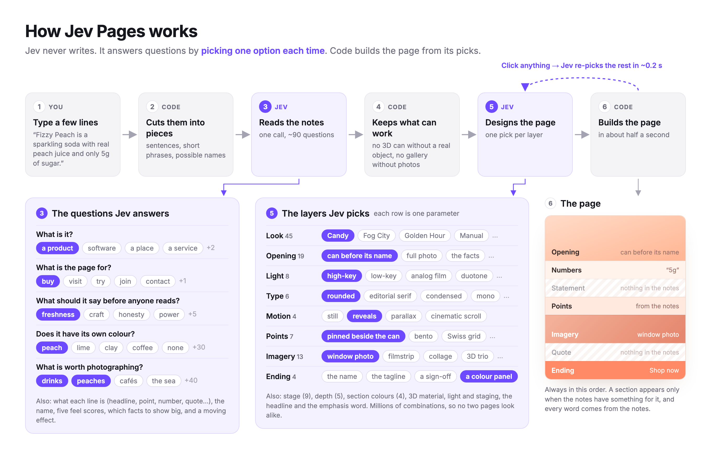

# Jev Pages

Type a few lines about your product and a landing page designs itself as you write.

Jev never writes text. It only picks between options: what your notes are about, what the page should say, and one choice for each layer of the design. Code builds the page from those picks.



## Run

```bash
python3 serve.py
```

This opens http://localhost:8787. Click **add Jev key** at the bottom left and paste your key. On a Mac you can also double-click `Jev Pages.command`.

You need only Python 3; there's nothing to install. Without a key the page still works, using a simple offline preview.

## What's here

| File | What it is |
|---|---|
| `jev-pages.html` | The whole app, in one file |
| `serve.py` | Local server; passes the page's calls to the Jev API |

Your key stays in your browser and only goes to the Jev API through `serve.py`.
